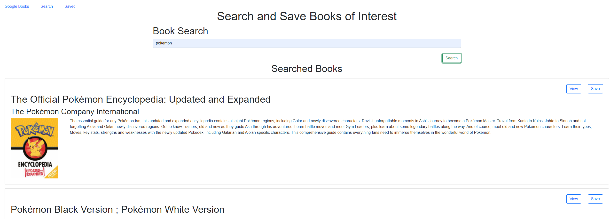
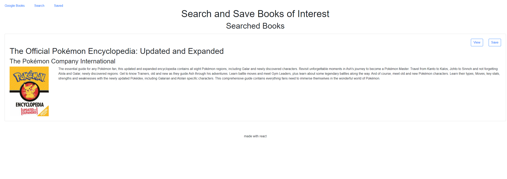

# ProjectBuild

## Summary

This application allows you to search for books using a google API call, and save them to a favorite list.

## Built with 

-React

React-Bootstrap


## Site Previews

A user can search for books by name and hit the save button

Saved books are loaded automatically upon going to the saved page


## Code snippets

The GET call to the google API
```

  getBook: function (search) {
    return axios.get(`https://www.googleapis.com/books/v1/volumes?q=${search}`);
  },
  ```

  The card compnent which takes in props and fills the page
  ```
  function Card(props) {
  const { link, title, image, author, description, handleSaveBook } = props;

  return (
    <div className="card my-3">
      <div className="d-flex justify-content-end mt-4">
        <a className="text-decoration-none" href={link} target="_blank" rel="noreferrer">
          <button className="btn btn-outline-primary d-inline mx-1">
            View
          </button>{" "}
        </a>
        <button className="btn btn-outline-primary d-inline mx-4" onClick={handleSaveBook} >Save</button>
      </div>
      <h1 className="mx-4">{title}</h1>
      <h2 className="mx-4">{author}</h2>
      <div className="d-flex justify-content-start">
        
        <p className="mx-4">{description}</p>
      </div>
    </div>
  );
}

export default Card;
```
 

## My Links

[Serena's GitHub](https://github.com/SerenaChandler)


[Thomas' GitHub](https://github.com/TMPeeler)


[Marko's GitHub](https://github.com/markosanchez800)


[Patrick's GitHub](https://github.com/pattymcpat)

[repo](https://github.com/SerenaChandler/ProjectBuild)

[deployed app]()